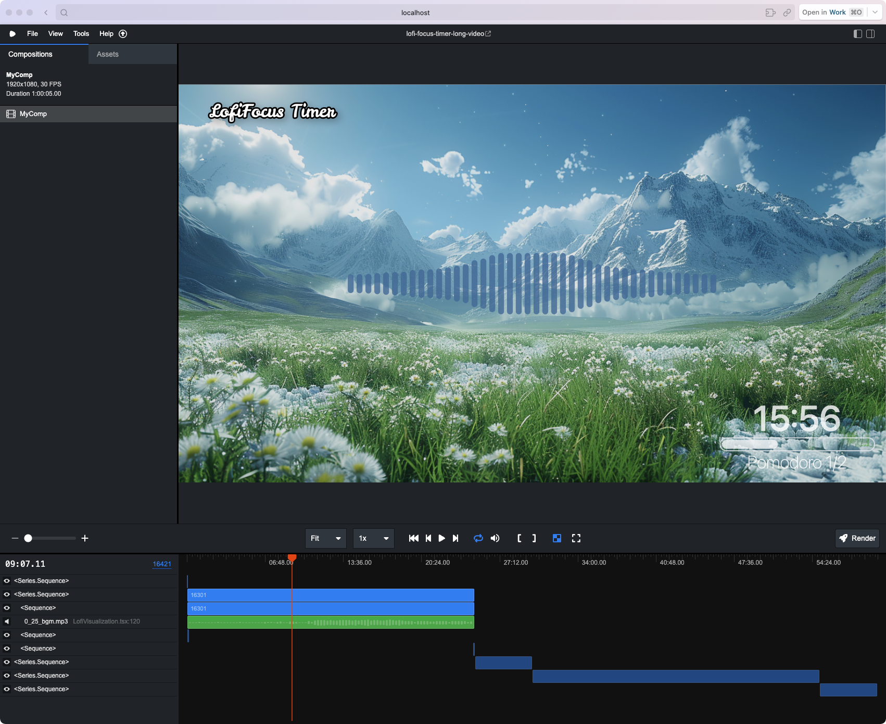

# Lofi Focus Timer Video

<p align="center">
  <a href="https://github.com/remotion-dev/logo">
    <picture>
      <source media="(prefers-color-scheme: dark)" srcset="https://github.com/remotion-dev/logo/raw/main/animated-logo-banner-dark.gif">
      
    </picture>
  </a>
</p>



Welcome to the Lofi Focus Timer Video project, a creative coding endeavor designed to transform your resources into a relaxing Lofi music video.

Discover more on my YouTube channel: [LofiFocus Timer](https://www.youtube.com/@LofiFocusTimer)

This tool enables you to craft a personalized Lofi music video by supplying your resources. Experience it firsthand by accessing the provided demo resources located at public/2024_05_16_12_26_English_1_hours.zip. Simply unzip the file and follow the instructions to get started.

While the project's codebase may be straightforward, unrefined, and lacks documentation, it efficiently accomplishes the following six tasks:

1. Incorporates an introduction sequence.
2. Embeds a customizable logo.
3. Sets up a background image.
4. Layers the chosen audio tracks.
5. Integrates audio visualization (Special thanks to: [Marcus Stenbeck](https://github.com/marcusstenbeck/remotion-audio-visualizers)).
6. Features a progress timer to indicate video duration.

## Getting Started

The project utilizes bun as its package manager. You are free to choose any package manager that suits your development needs.

### Setting Up the Demo

To use the demo's resources:

```shell
unzip public/2024_05_16_12_26_English_1_hours.zip -d public/
```

### Initiating the Project

Launch the project with:

```shell
bun start --port=9527 --props=./public/2024_05_16_12_26_English_1_hours/props.json
```

### Rendering the Video

Execute the following command to render your Lofi music video:

```shell
bun remotion render --output ./out/one_hours.mp4 --timeout 300000000 --concurrency=1 --props=./public/2024_05_16_12_26_English_1_hours/props.json --gl angle
```
